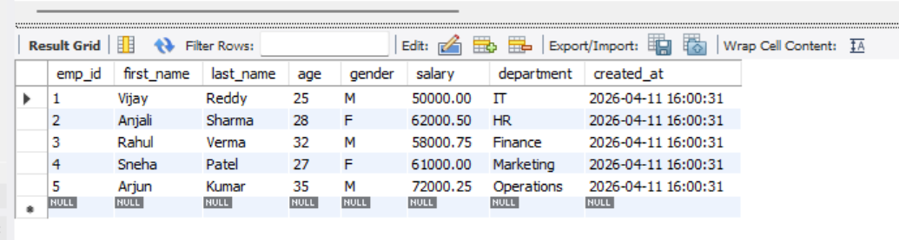

## Employee1 Table Implementation

- Created Employee1 table with proper structure and constraints like AUTO_INCREMENT, NOT NULL, CHECK, DEFAULT
- Used appropriate data types such as CHAR for gender and DECIMAL for salary for better accuracy and storage
- Added automatic fields like emp_id (primary key) and created_at (timestamp)

### output

