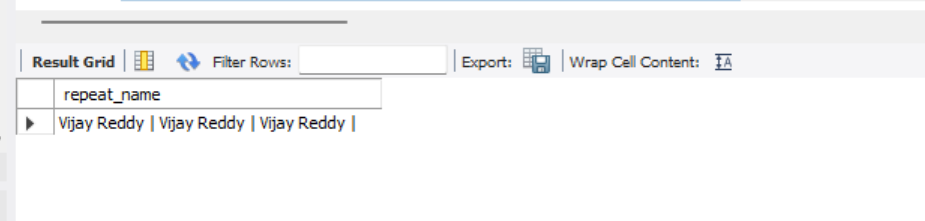

## Task-1

## Employee1 Table Implementation

- Created Employee1 table with proper structure and constraints like AUTO_INCREMENT, NOT NULL, CHECK, DEFAULT
- Used appropriate data types such as CHAR for gender and DECIMAL for salary for better accuracy and storage
- Added automatic fields like emp_id (primary key) and created_at (timestamp)

### output

## Task-2

## Difference between BETWEEN and >= , <= in SQL

- Functionality : No difference in result

- Readability : BETWEEN → cleaner and easier to read

- > = AND <= → more explicit and flexible

- Performance : No difference, Both are optimized the same way by SQL engine

## Task-4

- I was asked to work on LEFT OUTER JOIN and RIGHT OUTER JOIN. But LEFT OUTER JOIN is the same as LEFT JOIN, and RIGHT OUTER JOIN is the same as RIGHT JOIN. The keyword "OUTER" is optional, so there is no difference in functionality between them.

## Task-9

- Asked Implement looping logic within SQL functions

