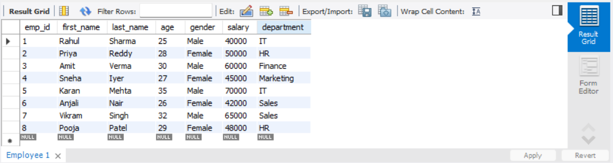

# Task 1 

## Creating and Populating Tables

**Objective:**  
Set up a simple table, insert data, and retrieve that data using basic queries.

**Requirements:**  
- Use `CREATE TABLE` to define a table (e.g., appropriate data types and constraints).  
- Populate the table using `INSERT INTO` with multiple rows of sample data.  
- Execute a basic `SELECT * FROM TableName;` query to verify the data insertion.
## Output

Below is the result of the query:

