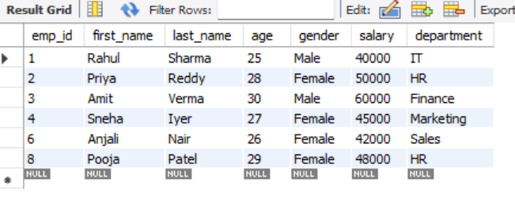

# Task 2 - Filtering and Sorting Data

## Objective

Filter records based on conditions and sort the results using SQL queries.

---

## Requirements

* Use `WHERE` to filter data
* Use `ORDER BY` to sort data 
* Use multiple conditions with `AND` / `OR`

---

## Example Queries along with output

### Query 1 Retrieve employees whose salary is between 40,000 and 60,000

