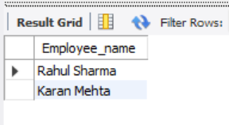
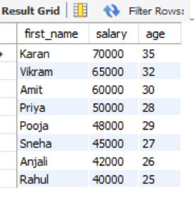
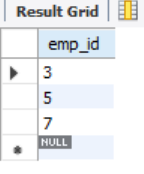
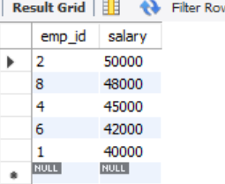

# Task 2 - Filtering and Sorting Data

## Objective

Filter records based on conditions and sort the results using SQL queries.

---

## Requirements

* Use `WHERE` to filter data
* Use `ORDER BY` to sort data 
* Use multiple conditions with `AND` / `OR`

---

## Example Queries along with output

### Retrieve employees whose salary is between 40,000 and 60,000

**Image Dimensions:** 800px × 600px

---

### Get employees full name whose age is between 25 and 35 AND department is IT

**Image Dimensions:** 800px × 600px

---

### Display employees sorted by salary in descending order and age in ascending order

**Image Dimensions:** 800px × 600px

---

### Retrieve employees whose salary is not between 40,000 and 50,000

**Image Dimensions:** 800px × 600px

---

### Display employees whose salary is less than 50,000 OR department is HR

**Image Dimensions:** 800px × 600px
