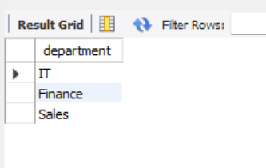
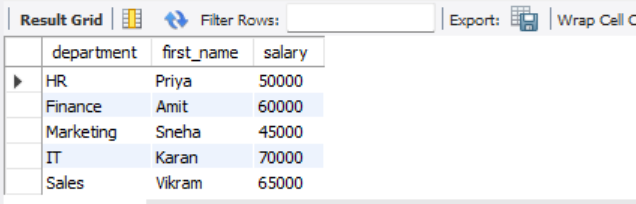
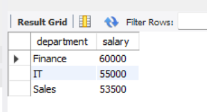
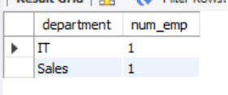

# Task 3 

## Simple Aggregation and Grouping

**Objective:**  
Summarize data using aggregate functions and grouping.

**Requirements:**  
- Write a query that uses aggregate functions such as `COUNT()`, `SUM()`, or `AVG()` to calculate totals or averages.  
- Use the `GROUP BY` clause to aggregate data by a specific column (e.g., count the number of employees per department).  
- Optionally, filter grouped results using the `HAVING` clause.

---

## Example Queries and output

#### Aggregate Functions

#### Find departments where the average salary is greater than 50,000

#### Retrieve the highest-paid employee in each department

#### Get the top 3 departments with the highest average salary

#### Count the number of employees in each department whose age is above 30

