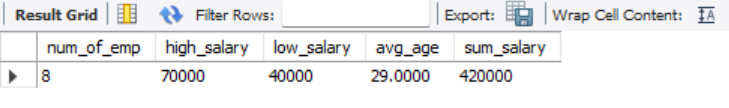

# Task 3 - Aggregate Functions and Grouping

## Objective
Summarize Employee data using aggregate functions and grouping. Optionally, filter grouped results using the HAVING clause and explore multi-table JOINs.

---

## Requirements

- Use aggregate functions such as:
  - `COUNT()` → to count rows
  - `SUM()` → to calculate totals
  - `AVG()` → to calculate averages
- Use `GROUP BY` to group data by a column
- Use `HAVING` to filter groups
- Optionally, perform multi-table JOINs if multiple tables exist

---

## Example Queries

### Aggregate Functions

