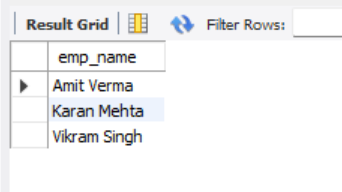
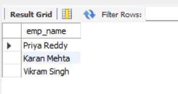
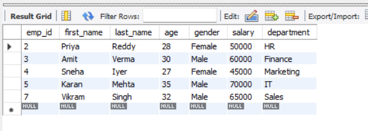
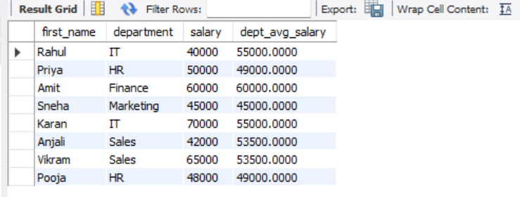

# Subqueries and Nested Queries

## Project Overview
This project demonstrates the use of **subqueries (nested queries)** in SQL to filter and compute values within a main query.

A **subquery** is a query inside another SQL query. It is commonly used in:
- `WHERE` clause → for filtering data  
- `SELECT` clause → for dynamic calculations  
- `FROM` clause → for temporary tables  

---

## Objectives
- Understand how to use subqueries in SQL.
- Learn how to filter data using subqueries in the `WHERE` clause.
- Use subqueries in the `SELECT` list for computed values.
- Differentiate between **correlated** and **non-correlated** subqueries.

---

## Query and Output

#### Retrieve employees whose salary is greater than the average salary of all employees

#### Find employees who earn the second highest salary in the company

#### Retrieve employees whose salary is greater than the average salary of their department

#### Retrieve employees whose salary is the highest in their department

####  Retrieve each employee’s name, department, and salary along with the average salary of their respective department

