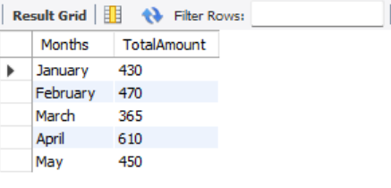
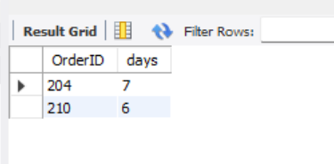
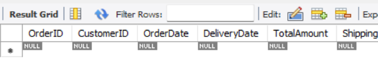

# Date and Time Functions in SQL

## Task Overview
This project demonstrates how to **manipulate and query data using date and time functions** in SQL.  
It focuses on retrieving, filtering, and formatting date-based data using built-in SQL functions.

---

## Objectives
- Use date functions like `DATEDIFF`, `DATE_ADD`
- Filter records based on date ranges (last 7 days, last 30 days, current month)
- Perform date-based aggregation
- Format date outputs using functions like `DATE_FORMAT` / `CONVERT`

---

### Create Database in MySQL
```sql
CREATE DATABASE SQL_Tasks;
USE SQL_Tasks;
```
### Table Structure
```
CREATE TABLE Orders (
    OrderID INT PRIMARY KEY,                 
    CustomerID INT,                  
    OrderDate DATE,                  
    DeliveryDate DATE,                        
    TotalAmount INT NOT NULL CHECK (TotalAmount >= 0), 
    ShippingAddress VARCHAR(255),             
    FOREIGN KEY (CustomerID) REFERENCES Customers(CustomerID)
);
 ```

### Query and output

#### Extract month-wise orders



#### Find all orders where the delivery took more than 5 days



#### retrieves orders from last 7 days



#### Converting total amount from int to decimal


