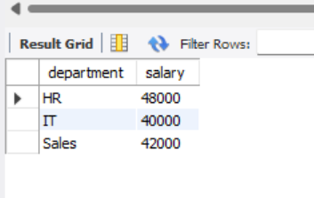
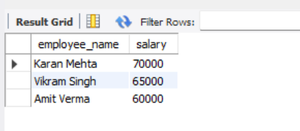
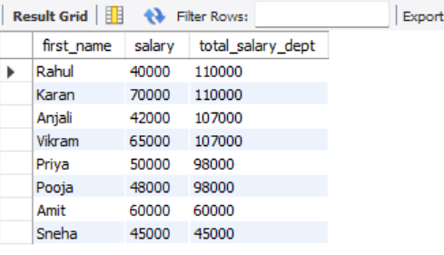
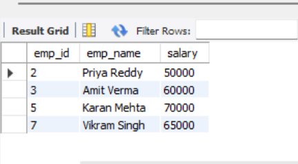
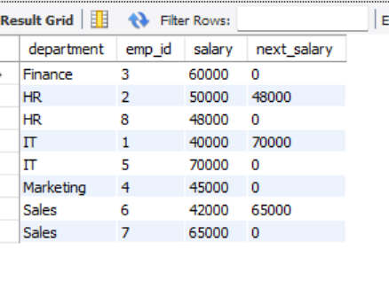

# Window Functions and Ranking in SQL

## Task Overview
This project demonstrates the use of **window functions** in SQL to perform calculations across a set of rows.  
It focuses on ranking, partitioning data, and accessing adjacent row values using functions like `ROW_NUMBER()`, `RANK()`, `DENSE_RANK()`, `LEAD()`, and `LAG()`.

---

## Objectives
- Use window functions for ranking and analysis  
- Apply `PARTITION BY` to group data  
- Use `ORDER BY` to define ranking order  
- Access previous and next row values using `LAG()` and `LEAD()`  

---

## Query and Output

#### Find the second highest Salary for each department

#### Find the top 3 highest-paid employees in the company 

#### Show each employee’s salary and the total salary of their department.

#### Identify employees whose salary is greater than the previous employee’s salary.

#### Department-wise LEAD

