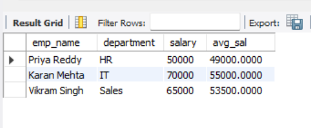
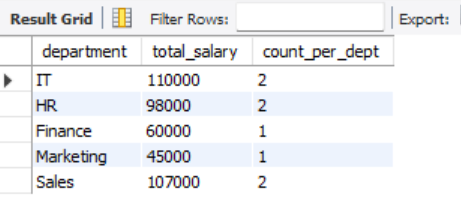
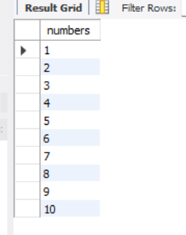
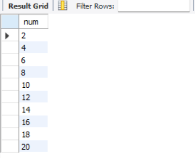

# Common Table Expressions (CTEs) and Recursive Queries in SQL

## Project Overview
This project demonstrates the use of **Common Table Expressions (CTEs)** in SQL to simplify complex queries and handle hierarchical or sequential data.  
It covers **non-recursive CTEs** for readability and **recursive CTEs** for generating sequences or hierarchical structures.

---

## Objectives
- Use **non-recursive CTEs** to break down complex queries  
- Use **recursive CTEs** to generate sequences or process hierarchical data  
- Ensure proper termination in recursive CTEs to prevent infinite loops  

---

## Query and Output

#### Employees earning above department average 

#### Find total salary and employees count per department

#### Display the numbers from 1 to 10 without using inbuilt function 

#### Display the Even Numbers 2 to 20

