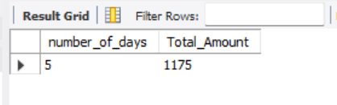
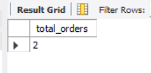
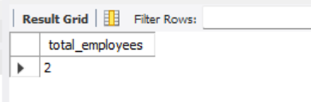
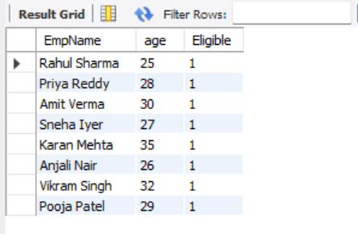

# Stored Procedures and User-Defined Functions (UDFs) in SQL

## Task Overview
This project demonstrates the use of **stored procedures** and **user-defined functions (UDFs)** to encapsulate business logic in SQL.  
It covers creating procedures with input parameters, scalar functions, and testing them with real data.

---

## Objectives
- Create **stored procedures** with input parameters  
- Return result sets from procedures (e.g., summary of orders)  
- Create **scalar UDFs** for calculations or validations  
- Test procedures and functions by calling them with sample inputs  

---

## Query and Output

#### number of orders and total amount between the given dates

#### Create a procedure that accepts a CustomerID and returns the total number of orders for that customer.

#### count the total number of employees in a given department

#### Create a function that takes FirstName and LastName and returns the full name

#### create a scalar User-Defined Function (UDF) in MySQL to check eligibility based on age

